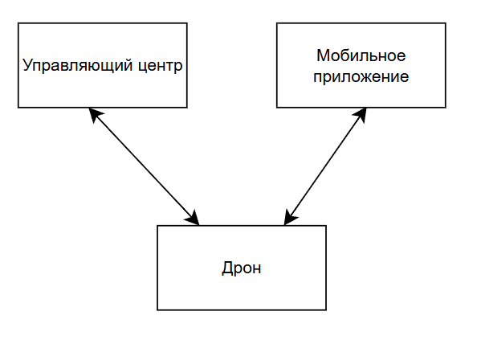
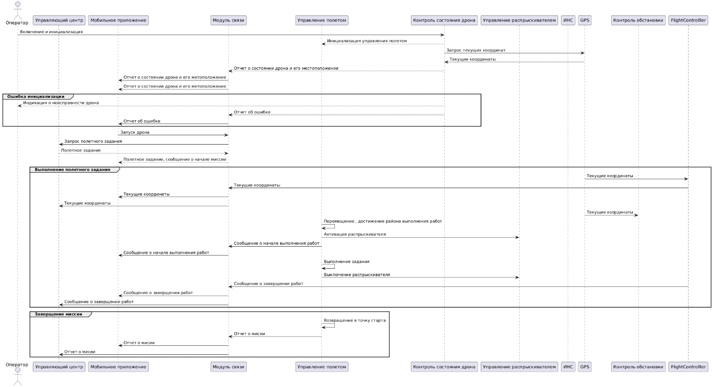
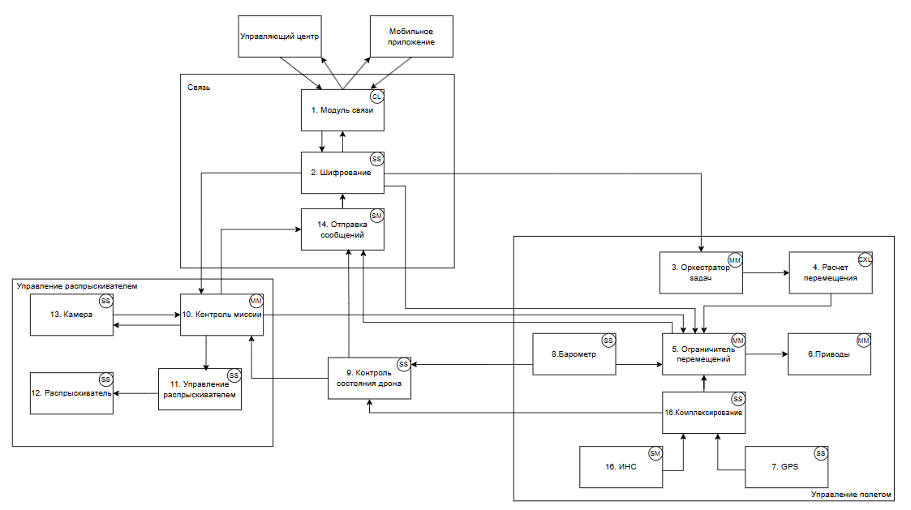
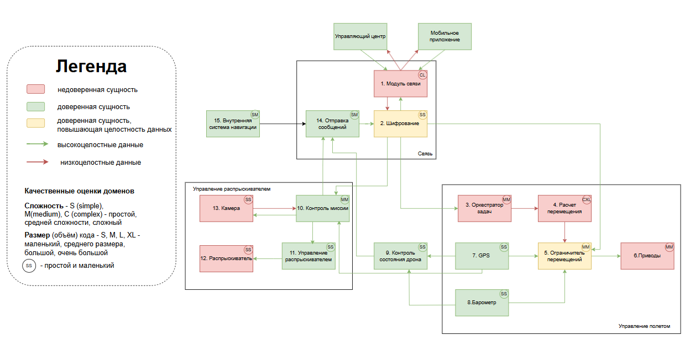

# Отчет о выполении задачи "Дрон опрыскиватель"

- [Дрон опрыскиватель](#отчёт-о-выполнении-задачи-name)
  - [Цель](#цель)
  - [Бизнес-процесс](#бизнес-процесс)
  - [Цели и Предположения Безопасности (ЦПБ)](#цели-и-предположения-безопасности)
  - [Требования](#требования)
    - [Доп огранечения для реализации прототипа](#дополнительные-ограничения-для-реализации-прототипа)
  - [Описание архитектуры (до кибериммунизации)](#архитектура-системы)
  - [Подсистемы](#Подсистемы)

  ## Цель
  - Необходимо создать программное обеспечение (далее – ПО) для беспилотного летательного аппарата (далее – дрон), с помощью которого можно обеспечить безопасное управление через мобильное приложение или управляющий центр (далее – УЦ) и выполнение задач дроном. К задачам дрона относим: распыление пестицидов или удобрений (далее – смесь) по заданному участку или сброс нужного количества смеси в конкретных координатах.

  ## Бизнес процесс
  - Управляющий центр (далее УЦ) владеет дронами для опрыскивания полей и других участков метсности удобрениями и  пестицидами. Бригада запуска выезжает на точку запуска дрона, после чего дрон инициализируется и отправляет сообщение о готовности в УЦ. УЦ отправляет миссию в дрон, после чего он приступает к выполнению задания, также у бригады запуска имеется мобильное приложение (далее МП) в котором отображаются текущие координаты дрона и статус выполения миссии. После выполнения задания на разбрызгивание дрон возвращается в точку запуска и отправляет в УЦ отчет о выполенном задании

### Ценности, ущербы и неприемлемые события

|Ценность|Негативное событие|Оценка ущерба|Комментарий|
|:-:|:-:|:-:|:-:|
|Дрон|В результате атаки потерпел крушение или был угнан|Средний|Дрон застрахован|
|Люди|В результате атаки дрон начал распыление в неправильном месте, смеси попали на людей|Высокий|Смеси могут быть токсичны|
|Инфраструктура|Дрон врезался в ЛЭП|Высокий||
|Имущество третьих лиц|Дрон врезался в технику или оборудование, расположенное в районе выполнения миссии |Высокий|

  ## Цели и предположения безопасности
  - Цель безопасности дрона
    1. Задания выполняются только в авторизованном районе
    2. При любых обстоятельствах выполняются только авторизованные управляющим центром задания
    3. При любых обстоятельствах распыление смеси происходит только на землю или растения
    4. При любых обстоятельствах УЦ должен иметь информацию о текущем состоянии дрона

 ### Предположения безопасности
 - Дрон защищен от физического воздействия
 - Не рассматриваются случаи подмены GPS координат
 - Монитор безопасности и брокер сообщений доверенные модули
 
 ## Требования 
 - Необходимо создать ПО, в котором будут реализованы следующие функции для корректной работы дрона:
   1. Обмен данными с УЦ: прием и отправка сообщений.
   2. Выполнение команд, принятых от мобильного приложения и УЦ.
   3. Геолокация: позиционирование на местности.
   4. Автономность: выполнение программы распыления смеси, защита в случае попытки перехвата управления или многократных попыток передачи некорректных сообщений, действия в случае потери связи.
   5. Контроль: уровень заряда, количество смеси, обработка территории, распознавание живых объектов (животных и людей), поломка.
   6. Мониторинг происходящего на земле: распыление смеси только на землю или растения.
   7. Возврат на базу в случае нештатных ситуаций. База имеет фиксированные координаты (x1,y1,z1).

## Дополнительные ограничения для реализации прототипа
 - Между собой сервисы общаются через шину сообщений (message bus), а всё снаружи принимают в виде REST 
 запросов.

## Архитектура системы

### Взаимодействия системы

 
### Сценарий работы

### Компоненты
 - Базовая архитектура

### Подсистемы

- Базовая диаграмма последовательностей

|Компонент|Назначение|
|:--|:--|
|1. Модуль связи|отвечает за взаимодействие с УЦ и мобильным приложением. В задаче использует только API.|
|2. Управление полетом|Контролирует состояние дрона. Контролирует исполнение полетного задания. Отслеживает позиционирование дрона в 3D.|
|3. Контроль состояния дрона|Контролирует уровень заряда батареи. Контролирует состояние распрыскивателя. Контролирует уровень смеси (сколько осталось). Контролирует состояние прочих модулей дрона.|
|4. Контроль обстановки|Контролирует высоту полета. Контролирует появление наземных объектов (люди, животные) в месте распрыскивания смеси. Контролирует состояние датчиков столкновения.|
|5. GPS навигация|Выдаёт текущие координаты (x, y, z). Отслеживает прерывание сигнала. Отслеживает ошибки позиционирования.|
|6. Внутренная навигация|Ведет GPS-независимую карту полета. Строит аварийный маршрут возвращения на базу.|
|7. Управление распрыскивателем|Контролирует расход смеси. Отключает и включает распрыскиватель в заданных точках маршрута. Управляет аварийным выключением распрыскивателя.|

### Негативные сценарии
|Название сценария|Описание|
|---|----------------------|
|НС-1| При компрометации модуля связи было подменено полетное задание (нарушение ЦБ 2)|
|НС-2| При компрометации модуля связи УЦ получил недостоверную информацию о дроне  (нарушение ЦБ 4)|
|НС-3| При компрометации модуля управления полета злоумышленник подменил полетное задание (нарушение ЦБ 2)|
|НС-4| При компрометации модуля управления полетом злоумышленник подменил информацию о состоянии дрона (Нарушение ЦБ 4)|
|НС-5| При компрометации модуля управления полетом злоумышленник направил дрон в неавторизованный район (Нарушение ЦБ 1)|
|НС-6| При компрометации модуля контроля состояния дрона злоумышленник подменил информацию о текущем состоянии дрона (Нарушение ЦБ 4)|
|НС-7| При компрометации модуля управления распрыскивателем злоумышленник начал произвольное распыление смеси (Нарушено ЦБ 3)|
|НС-8| При компрометации модуля контроля обстановки злоумышленник подменил информацию о наземных объектах в зоне работы дрона (Нарушено ЦБ 3)|
|НС-9| При компрометации модуля контроля обстановки злоумышленник подменил информацию о текущей высоте дрона (Нарушено ЦБ 4)|
|НС-10| При компрометации модуля контроля обстановки злоумышленник подменил информацию о текущей высоте дрона, в результате чего дрон вылетел из авторизованного района (Нарушено ЦБ 1)|

|Атакованный компонент|ЦБ1|ЦБ2|ЦБ3|ЦБ4|Кол-во нарушений|
|:--|:-:|:-:|:-:|:-:|:-:|
|1. Связь|🟢|🔴|🟢|🔴|2/4|
|2. Управление полетом|🔴|🔴|🟢|🔴|3/4|
|3. Контроль состояния дрона|🟢|🟢|🟢|🔴|1/4|
|4. Управление распрыскивателем|🟢|🟢|🔴|🟢|1/4|
|5. Контроль обстановки|🔴|🟢|🔴|🔴|3/4|
|6. GPS|🟢|🟢|🟢|🟢|0/4|
|7. Внутренняя навигация|🟢|🟢|🟢|🟢|0/4|

🟢 - ЦБ не нарушена 🔴 - ЦБ нарушена

## Переработанная архитектура

1) Добавить шифрование канала связи
2) Вынести датчики сделать их доверенными
3) добавить модуль отправки сообщений сделать доверенным
4) убрать функционал оценки среды в УЦ (отправлять фото или видео с района распыления)
5) В контроле состояния оставить только инфу с датчиков
6) добавить ограничетель или сверку местоположения (оставить управление красным)

### Обновленная таблица компонентов дрона
|Компонент|Описание|Комментарий|
|:---|:--|:--|
|1. Модуль связи|отвечает за взаимодействие с УЦ и мобильным приложением.| В задаче использует только API.|
|2. Модуль шифрования|Расшифрование/шифрование/подпись принимаемых/отправляемых пакетов данных.|Работает при помощи SSL протокола. Предполагается, что в УЦ и мобильном приложении тоже реализован данный функционал|
|3. Оркестратор задач|Распределение задач.|Отправляет параметры маршрута в расчет перемещения, контроль маршрута и контроль выполнения задания. Также занимается передачей сообщений для их последующей отправки с судна|
|4. Расчет перемещения|Расчет перемещений дрона|Рассчитывает угол и скорость вращения приводов и моторов для достижения очередной точки маршрута|
|5. Ограничитель перемещения|Проверка работы модуля расчета перемещения|Проверяет вычисления полученные в модуле расчета перемещения на предмет соответствия маршруту|
|6. Приводы|Сервоприводы и драйверы||
|7. GPS|Выдаёт текущие координаты (x, y, z). Отслеживает прерывание сигнала. Отслеживает ошибки позиционирования.||
|8. Барометр|Датчик показывающий текущую высоту дрона||
|9. Контроль состояния дрона|Отвечает за сбор данных о дроне (местоположение, высота, состояние аккамуолятора).||
|10. Контроль миссии|Отвечает за выполнение дроном полетного задания|Сверяет текущие местоположение с координатами начала миссии, также дает команду на включение распрыскивателя|
|11. Управление распрыскивателем|Контролирует расход смеси. Отключает и включает распрыскиватель.||
|12. Распрыскиватель|Физический распрыскиватель||
|13. Камера|Осуществляет видео-фото съемку района работ||
|14. Отправка сообщений|Осуществляет подготовку и отправку сообщений||
|15. Внутренняя навигация|Ведет GPS-независимую карту полета. Строит аварийный маршрут возвращения на базу.||

### Обновленная схема взаимодействия модулей дрона

### Описание декомпозиции

Описание декомпозиции

<table>
    <thead>
        <tr>
            <th align="center">Исходный компонент</th>
            <th align="center">Декомпозиция</th>
        </tr>
    </thead>
    <tbody>
        <tr>
            <td rowspan=4 align="center">Система связи</td>
        </tr>
          <tr>
            <td rowspan=1 align="center">Связь</td>
          </tr>
          <tr>
            <td rowspan=1 align="center">Модуль шифрования</td>
          </tr>
          <tr>
            <td rowspan=1 align="center">Отправка сообщений</td>
          </tr>
          <tr>
            <td rowspan=7 align="center">Управление полетом</td>
          </tr>
          <tr>
            <td rowspan=1 align="center">Оркестратор задач</td>
          </tr>
          <tr>
            <td rowspan=1 align="center">Расчет перемещения</td>
          </tr>
          <tr>
            <td rowspan=1 align="center">Ограничитель перемещения</td>
          </tr>
          <tr>
            <td rowspan=1 align="center">GPS</td>
          </tr>
          <tr>
            <td rowspan=1 align="center">Приводы</td>
          </tr>
          <tr>
            <td rowspan=1 align="center">Барометр</td>
          </tr>
       <tr>
            <td rowspan=5 align="center">Управление распрыскивателем</td>
        </tr>
        <tr>
            <td rowspan=1 align="center">Контроль миссии</td>
        </tr>
        <tr>
            <td rowspan=1 align="center">Камера</td>
        </tr>
        <tr>
            <td rowspan=1 align="center">Управление распрыскивателем</td>
        </tr>
        <tr>
            <td rowspan=1 align="center">Распрыскиватель</td>
        </tr>
    </tbody>
</table>

## Указание "доверенных компонент" на архитектурной диаграмме

#### Таблица доверенных компонентов и их качественная оценка

|Компонент|Уровень доверия|Обоснование|Комментарий|Оценка|Комментарий к оценке|
|:--|:--|:--|:--|:--|:--|
|1. Модуль связи|$\textcolor{red}{\textsf{Недоверенный}}$| При компрометации не нарушает ЦБ|В системе присутствует модуль шифрования который не позволяет злоумышленнику получить/изменить информацию|CL|Предполагает использование различных сетевых протоколов и настройку аппаратной части|
|2. Модуль шифрования|$\textcolor{orange}{\textsf{Повышающий доверие}}$|При компрометации нарушает ЦБ 2, 4||SS|Реализация одного криптографического протокола для шифрования и расшифрования|
|3. Оркестратор задач|$\textcolor{red}{\textsf{Недоверенный}}$|При компрометации не нарушает ЦБ||MM|Работа с пришедшими сообщениями, распределение задач|
|4. Расчет перемещения|$\textcolor{red}{\textsf{Недоверенный}}$|При компрометации не нарушает ЦБ||CXL|Предеполагает реализацию сложных математических алгоритмов возможно компьютерного зрения|
|5. Ограничитель перемещения|$\textcolor{orange}{\textsf{Повышающий доверие}}$|При компрометации нарушает ЦБ 1, 2|Не позволяет злорумышленнику даже при скомпрометированном модуле расчета перемещения отклонить дрон от маршрута|MM|Контролирует потоки информации с нескольких модулей|
|6. Приводы|$\textcolor{red}{\textsf{Недоверенный}}$|При компрометации не нарушает ЦБ|В случае компрометации ограничитель отключает питание приводов|MM|Предполагают настройку аппаратной части|
|7. GPS|$\textcolor{green}{\textsf{Доверенный}}$|Доверенный по предположению безопасности||SS|Аппаратный модуль спутниковой системы связи|
|8. Барометр|$\textcolor{green}{\textsf{Доверенный}}$|При компрометации нарушает ЦБ 4||SS|Аппаратный модуль определения высоты|
|9. Контроль состояния дрона|$\textcolor{green}{\textsf{Доверенный}}$|При компрометации нарушает ЦБ 4||SS|Собирает информацию о состоянии дрона|
|10. Контроль миссии|$\textcolor{green}{\textsf{Доверенный}}$|При компрометации нарушает ЦБ 3||MM|Сверяет координаты миссии с текущими, также принимает решение по включению/выключению|
|11. Управление распрыскивателем|$\textcolor{green}{\textsf{Доверенный}}$|При компрометации нарушает ЦБ 3||SS|Отвечает за аварийное выключение распрыскивателя, кол-во оставшийся смеси|
|12. Распрыскиватель|$\textcolor{red}{\textsf{Недоверенный}}$|При компрометации не нарушает ЦБ|При непредвиденном вклбючении модуль управления распрыскивателем обнаружит учечку смеси и отключит питание распрыскивателя|SS|Аппаратный модуль распрыскивателя|
|13. Камера|$\textcolor{red}{\textsf{Недоверенный}}$|При компрометации не нарушает ЦБ|Может не отправить фото местности, что не нарушает ЦБ|SS|Аппаратный модуль фото-видео фиксации|
|14. Отправка сообщений|$\textcolor{green}{\textsf{Доверенный}}$|При компрометации нарушается ЦБ 4||SM|Сбор и отправка сообщений в канал связи|
|15. Внутренняя навигация|$\textcolor{green}{\textsf{Доверенный}}$|При компрометации не нарушает ЦБ|Модуль необхоодим что отработки внештатных ситуации при компрометации GPS, который является доверенным по ПБ|SM|Союственная система отсчета|

### Замечания к реализации
1) В некоторых модулях (например шифрование) , функции будут представлять из себя API или заглушку для простоты реализации
2) Предполагается что когда дрон достигает точки начала работ он осуществляет его фото-видео фикстацию и отправляет эти материалы в УЦ, будем считать что УЦ располагает алгоритмом компьютерного зрения который определяет наличие посторонних объектов в зоне проведения работ и УЦ отправляет в дрон разрешение на начало проведения работ
3) Оператор будет представлен как пользователь мобильного приложения (не будет явно пресутсвовать в решении)
